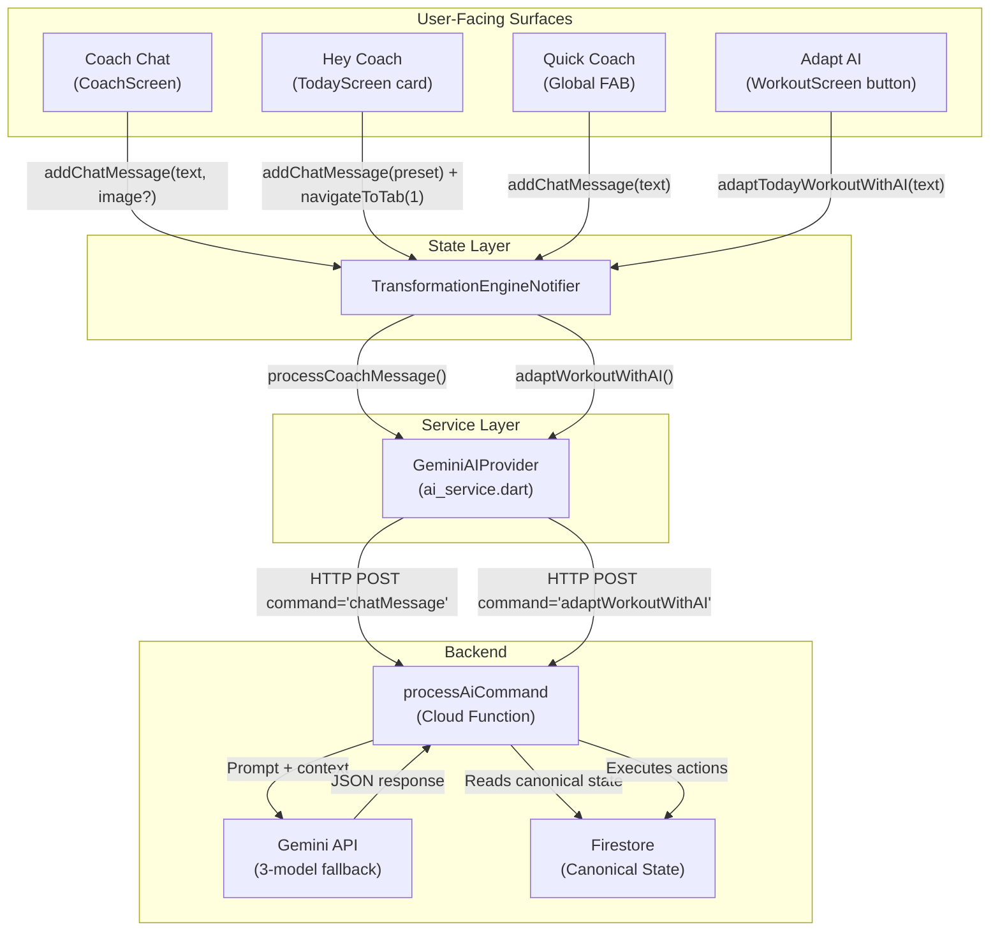
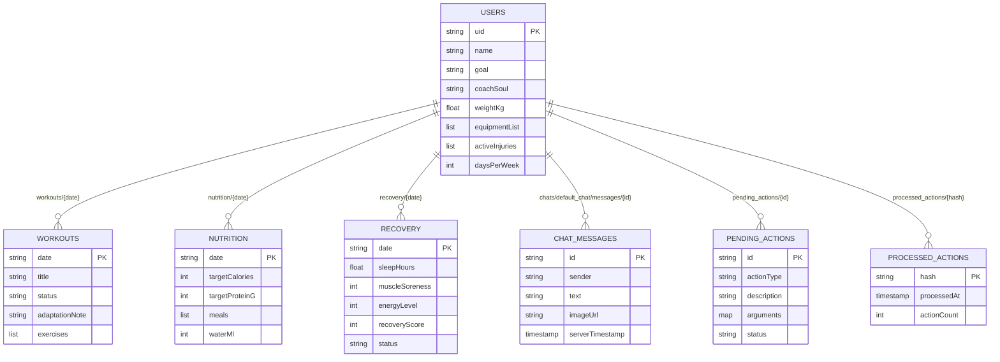

# AURA AI Interaction Surfaces — Architecture & Deep Analysis

> **Scope**: This document maps the four distinct AI interaction surfaces in the AURA fitness coach app: **Coach Chat**, **Hey Coach**, **Adapt AI**, and **Quick Coach**. It covers their capabilities, system prompts, data flows, database mutations, and architectural boundaries.
>
> **Last Updated**: 2026-09-07 | **Confirmed From**: Source code analysis of `flutter_app/` and `functions/src/`

---

## Overview

AURA has **four user-facing AI interaction surfaces**, each designed for a different user intent and context. Despite surface differences, they all ultimately call the same backend Cloud Function (`processAiCommand`) — but with different `command` strings, system prompts, and output schemas.

| Surface | Location | Primary Purpose | Backend Command | Response Type |
|:---|:---|:---|:---|:---|
| **Coach Chat** | Coach tab (full screen) | Multi-turn conversational coaching + multi-domain actions | `chatMessage` | `AIOrchestratorResult` (text + actions) |
| **Hey Coach** | Today Screen (embedded card) | Quick-action launcher → navigates to Coach Chat | `chatMessage` (via `addChatMessage`) | Same as Coach Chat |
| **Adapt AI** | Workout Screen (app bar button) | Single-turn workout-only modification | `adaptWorkoutWithAI` | Void (server writes to Firestore directly) |
| **Quick Coach** | Global FAB (floating button) | Context-aware micro-deviations & instant logs | `chatMessage` (via `addChatMessage`) | Same as Coach Chat |



---

## 1. Coach Chat (Full Conversational AI)

### Entry Point
[`CoachScreen`](file:///Users/meragi/Downloads/personal-transformation-coach/flutter_app/lib/screens/coach_screen.dart) — Navigation Tab index 1.

### Capabilities (Superset of All Other Surfaces)
This is the **most powerful** surface. It can:

1. **Converse** — Multi-turn dialogue with full Markdown rendering, thinking animation, persona-adaptive tone
2. **Log Nutrition** — Parse meals from text or photos, estimate macros, verify via OpenFoodFacts API
3. **Log Recovery** — Extract sleep hours, muscle soreness, energy levels, stress
4. **Log Weight** — Detect explicit scale reports
5. **Adapt Workouts** — Modify today's exercises in-place
6. **Portion Corrections** — Edit or remove previously logged meals
7. **Structural Changes (Gated)** — Propose equipment updates, goal changes, injury updates, schedule changes, weekly plan regeneration — these go into a `pending_actions` queue requiring explicit user approval
8. **Multimodal** — Accept camera/gallery photos for food scanning or workout display recognition
9. **Image Upload** — Firebase Storage upload → public URL passed to Cloud Function

### System Prompt
`command: 'chatMessage'` — The **Two-Pass Orchestrator** prompt ([index.ts:330-361](file:///Users/meragi/Downloads/personal-transformation-coach/functions/src/index.ts#L330-L361)):
- Injects Coach Soul tone (Supporter / Pro / Teacher)
- Injects ~100-word compressed semantic context
- Mandates generating `coachResponse` string FIRST, then `actions` array
- Provides 12 available action types with their argument schemas

### Data Flow
```
User types/sends photo → _sendMessage() → addChatMessage()
  → isAiThinking = true
  → Save user ChatMessage to Firestore
  → processCoachMessage() → HTTP POST command='chatMessage'
  → Cloud Function:
      1. Verify Firebase auth token
      2. Read canonical state from Firestore (profile, workout, nutrition, recovery)
      3. Compress state to ~100-word paragraph
      4. Call Gemini with persona + context + message
      5. Parse JSON: { coachResponse, actions[] }
      6. Execute actions: logNutrition → Firestore, logRecovery → Firestore, etc.
      7. Structural actions → pending_actions collection
      8. Idempotency hash stored in processed_actions
  → Return { coachResponse, actions, pendingActions }
  → Save AI ChatMessage to Firestore
  → isAiThinking = false
```

### Database Writes
| Action | Firestore Path | Trigger |
|:---|:---|:---|
| Chat messages | `users/{uid}/chats/default_chat/messages/{id}` | Every send |
| Meals | `users/{uid}/nutrition/{YYYY-MM-DD}` | `logNutrition` action |
| Recovery | `users/{uid}/recovery/{YYYY-MM-DD}` | `logRecovery` action |
| Weight | `users/{uid}` + `users/{uid}/progress/{date}` | `logWeight` action |
| Workout status | `users/{uid}/workouts/{YYYY-MM-DD}` | `updateWorkoutStatus` action |
| Workout adapt | `users/{uid}/workouts/{YYYY-MM-DD}` | `adaptWorkout` action |
| Meal edit | `users/{uid}/nutrition/{date}` | `updateMealPortion` action |
| Meal remove | `users/{uid}/nutrition/{date}` | `removeMeal` action |
| Structural | `users/{uid}/pending_actions/{actionId}` | `updateEquipment`, `updateGoal`, etc. |
| Idempotency | `users/{uid}/processed_actions/{hash}` | After action execution |

### UI Features Unique to Coach Chat
- **Inline Decision Cards**: Pattern-matches AI response text for workout adaptations and meal logs → renders interactive Accept/Edit/Keep buttons
- **Pending Action Security Gate**: Renders approve/reject buttons for structural changes
- **Express Actions Modal**: Quick +250ml water, log meal prefix, report soreness shortcuts
- **Dynamic Persona Chips**: Soul-specific suggestion chips (Supporter: "Celebrate a small win!", Pro: "Lock in today's workout", Teacher: "Explain my protein target")
- **Coach Hub Modal**: Real-time switch between Coach Souls + view active memory context
- **Media Options Modal**: Camera capture + gallery picker for multimodal analysis

### Key Files
| File | Symbol | Role |
|:---|:---|:---|
| [`coach_screen.dart`](file:///Users/meragi/Downloads/personal-transformation-coach/flutter_app/lib/screens/coach_screen.dart) | `CoachScreen`, `_CoachScreenState` | Full UI |
| [`transformation_state.dart`](file:///Users/meragi/Downloads/personal-transformation-coach/flutter_app/lib/providers/transformation_state.dart) | `addChatMessage()` | State dispatch |
| [`ai_service.dart`](file:///Users/meragi/Downloads/personal-transformation-coach/flutter_app/lib/services/ai_service.dart) | `processCoachMessage()` | HTTP bridge |
| [`index.ts`](file:///Users/meragi/Downloads/personal-transformation-coach/functions/src/index.ts#L326-L593) | `case "chatMessage"` | Server orchestrator |

---

## 2. Hey Coach (Dashboard Quick-Launch Card)

### Entry Point
[`TodayScreen`](file:///Users/meragi/Downloads/personal-transformation-coach/flutter_app/lib/screens/today_screen.dart#L293-L430) — Embedded `AuraCard` positioned directly below today's workout card.

### Capabilities
**Hey Coach is NOT a separate AI engine.** It is a **shortcut launcher** that:
1. Fires a pre-composed message into the same Coach Chat pipeline (`addChatMessage`)
2. Immediately switches navigation to the Coach tab (`onNavigateToTab?.call(1)`)

The AI response appears in the Coach Chat screen, not on the Today Screen.

### Available Quick Prompts (Hardcoded)
```dart
"I'm sore today — please adapt my session."
"I only have 20 mins today — please adapt my workout."
"What should I eat for dinner based on my remaining macros?"
"I want to swap an exercise from today's workout."
```

Plus a tap-through bar: **"Ask your Coach anything..."** → navigates to Coach tab.

### System Prompt
**None of its own** — uses the full `chatMessage` orchestrator prompt. The hardcoded prompts are just pre-composed user messages.

### Data Flow
```
User taps chip → notifier.addChatMessage("I'm sore today...")
               → onNavigateToTab?.call(1)  // Switch to Coach tab
               → (Same full chatMessage flow as Coach Chat)
```

### Key Difference from Coach Chat
| Dimension | Hey Coach | Coach Chat |
|:---|:---|:---|
| **Location** | Today Screen (Home tab) | Standalone screen (Tab 1) |
| **Interaction** | One-tap predefined prompts | Full keyboard, media, express actions |
| **Chat History** | Not visible (only prompt chips) | Full scrollable history (50+ messages) |
| **Response Rendering** | User is auto-navigated to Coach tab to see response | In-place rendering with inline cards |
| **Purpose** | Reduce friction for common daily actions | Full multi-turn coaching dialogue |

### Key Files
| File | Symbol | Role |
|:---|:---|:---|
| [`today_screen.dart`](file:///Users/meragi/Downloads/personal-transformation-coach/flutter_app/lib/screens/today_screen.dart#L293-L430) | `_buildCoachPromptChip()` | UI chips |

---

## 3. Adapt AI (In-Workout Exercise Modification)

### Entry Point
[`WorkoutScreen`](file:///Users/meragi/Downloads/personal-transformation-coach/flutter_app/lib/screens/workout_screen.dart#L51-L58) — `TextButton.icon` labeled "Adapt AI" with sparkles icon in the AppBar.

### Capabilities
**Strictly single-turn, workout-only**. It can:
1. **Replace exercises** — Swap exercises that conflict with user constraints (injury, equipment unavailability)
2. **Modify volume** — Adjust sets, reps, and weight targets
3. **Rename workout** — Update title to reflect adaptation (e.g., "Quick 20-Min Push")
4. **Add adaptation note** — Explain why/how the workout changed

It **CANNOT**:
- Log nutrition, recovery, or weight
- Make structural changes (goals, equipment, schedule)
- Start a multi-turn conversation
- Accept images

### System Prompt
`command: 'adaptWorkoutWithAI'` ([index.ts:1006-1054](file:///Users/meragi/Downloads/personal-transformation-coach/functions/src/index.ts#L1006-L1054)):
```
You are an elite strength coach adapting a workout plan.
User Context: ${compressedMemory}
Adaptation Request: "${adaptationRequest}"
Current Workout: ${effectiveState?.workout?.title || 'Unknown'}

Modify the exercises to suit the adaptation request.
Return JSON: { title, adaptationNote, exercises[] }
```

### Data Flow
```
User taps "Adapt AI" → _showAIAdaptationBottomSheet() → types constraint
  → adaptTodayWorkoutWithAI(prompt)
  → _aiService.adaptWorkoutWithAI(request, state)
  → HTTP POST command='adaptWorkoutWithAI'
  → Cloud Function:
      1. Verify auth, read canonical state
      2. Compress context
      3. Call Gemini with adaptation-specific prompt
      4. Parse JSON: { title, adaptationNote, exercises[] }
      5. Write DIRECTLY to Firestore workouts/{today} with status="adapted"
  → Client: state.adaptationNotice = "Workout adapted..."
  → Firestore snapshot listener updates local workout state
```

### Database Writes
| Path | What Changes |
|:---|:---|
| `users/{uid}/workouts/{YYYY-MM-DD}` | `title`, `status: "adapted"`, `adaptationNote`, `exercises[]` overwritten |

### Key Difference from Coach Chat
| Dimension | Adapt AI | Coach Chat |
|:---|:---|:---|
| **Scope** | Workout exercises ONLY | All domains (nutrition, recovery, goals, etc.) |
| **Turn Model** | Single-turn (fire and forget) | Multi-turn conversational |
| **Action Gating** | No approval needed — writes directly | Structural changes require user approval |
| **Response** | No coach text response in chat | Full conversational response + inline cards |
| **Prompt** | Workout-specialist prompt | General orchestrator with 12 action types |
| **State Update** | Server writes, client listens via Firestore | Server writes + client processes pendingActions |

### Key Files
| File | Symbol | Role |
|:---|:---|:---|
| [`workout_screen.dart`](file:///Users/meragi/Downloads/personal-transformation-coach/flutter_app/lib/screens/workout_screen.dart#L591-L697) | `_showAIAdaptationBottomSheet()` | UI modal |
| [`transformation_state.dart`](file:///Users/meragi/Downloads/personal-transformation-coach/flutter_app/lib/providers/transformation_state.dart#L1638-L1645) | `adaptTodayWorkoutWithAI()` | State dispatch |
| [`ai_service.dart`](file:///Users/meragi/Downloads/personal-transformation-coach/flutter_app/lib/services/ai_service.dart#L216-L228) | `adaptWorkoutWithAI()` | HTTP bridge |
| [`index.ts`](file:///Users/meragi/Downloads/personal-transformation-coach/functions/src/index.ts#L1006-L1054) | `case "adaptWorkoutWithAI"` | Server handler |

---

## 4. Quick Coach (Context-Aware Floating Companion)

### Entry Point
[`QuickCoachFAB`](file:///Users/meragi/Downloads/personal-transformation-coach/flutter_app/lib/widgets/common/quick_coach_fab.dart) — Floating action button available on multiple screens. Uses `contextTag` to adapt its behavior.

### Capabilities
Quick Coach is an **overlay bottom sheet** that:
1. Shows **context-aware suggestion chips** based on where the user is
2. Provides a **free-text input field** for custom messages
3. Routes everything through `addChatMessage()` — the same full Coach Chat orchestrator

It **does NOT** have its own dedicated AI endpoint. It is a UX convenience wrapper around the Coach Chat pipeline.

### Context-Aware Chip Sets
```dart
// contextTag == 'workout' (WorkoutScreen)
"Squat rack is taken, swap it"
"Shoulder pain, swap press"
"Low energy, deload 20%"
"Only have 20 minutes left"

// contextTag != 'workout' (TodayScreen, etc.)
"Ate lunch: 2 eggs & toast"
"Slept poorly (5 hours), feel tired"
"Had 500ml water"
"Knee feels tight today"
```

### System Prompt
**None of its own** — uses the full `chatMessage` orchestrator. The suggestion chips are just pre-composed user messages.

### Data Flow
```
User taps FAB → showQuickCoachModal() → bottom sheet opens
  → User taps chip OR types custom text
  → _sendDeviation(text) → analytics log (input_type: 'quick_coach_fab')
  → addChatMessage(prompt)  // Full orchestrator pipeline
  → Navigator.pop()  // Dismiss sheet
  → SnackBar: "AURA adapted your program in real-time!"
```

### Key Difference from Other Surfaces
| Dimension | Quick Coach | Hey Coach | Adapt AI | Coach Chat |
|:---|:---|:---|:---|:---|
| **Location** | FAB overlay (any screen) | Today Screen card | Workout Screen bar | Full Coach tab |
| **Persistence** | Transient bottom sheet | Embedded widget | Modal bottom sheet | Persistent screen |
| **Feedback** | SnackBar toast (no chat view) | Navigates to Coach tab | SnackBar toast | In-place chat bubbles |
| **Context Chips** | Screen-aware (workout vs. general) | Fixed 4 prompts | No chips (free text only) | Soul-specific chips |
| **Backend** | `chatMessage` orchestrator | `chatMessage` orchestrator | `adaptWorkoutWithAI` | `chatMessage` orchestrator |
| **Can log nutrition?** | ✅ Yes | ✅ Yes | ❌ No | ✅ Yes |
| **Can adapt workout?** | ✅ Yes (via orchestrator) | ✅ Yes (via orchestrator) | ✅ Yes (dedicated) | ✅ Yes (via orchestrator) |
| **Can change goals?** | ✅ Yes (pending approval) | ✅ Yes (pending approval) | ❌ No | ✅ Yes (pending approval) |

### Key Files
| File | Symbol | Role |
|:---|:---|:---|
| [`quick_coach_fab.dart`](file:///Users/meragi/Downloads/personal-transformation-coach/flutter_app/lib/widgets/common/quick_coach_fab.dart) | `QuickCoachFAB`, `_QuickCoachSheet` | UI widget |

---

## Non-AI Workout Interactions (Important Contrast)

The Workout Screen also has two **non-AI** interaction mechanisms that are critical to distinguish:

### Exercise Substitution (Deterministic, No AI)
- **Trigger**: Swap icon (`LucideIcons.arrowLeftRight`) per exercise
- **Logic**: Queries [`ExerciseDatabase.getSubstitutions()`](file:///Users/meragi/Downloads/personal-transformation-coach/flutter_app/lib/models/exercise_definition.dart#L434) — matches on `movementPattern` and `availableEquipment`
- **Latency**: Instant (local database lookup, zero network)
- **Scope**: Single exercise swap, preserving set structure

### Set Micro-Adjustments (Local, No AI)
- **Trigger**: Tap reps/weight text per set → `_showSetAdjustmentModal()`
- **Logic**: `+/-` steppers for reps (by 1) and weight (by 2.5kg)
- **Latency**: Instant (local state update)
- **Scope**: Individual set targets within a single exercise

---

## Shared Backend Architecture

### Gemini Model Fallback Chain
```typescript
const candidateModels = [
  "gemini-3.5-flash-lite",   // Primary (fastest, cheapest)
  "gemini-3.1-flash-lite",   // Fallback 1
  "gemini-3.5-flash",        // Fallback 2 (most capable)
];
```
Each model gets 2 retry attempts. 400ms backoff on 503/429. No wildcard discovery.

### Semantic Context Compression
[`compressSemanticState()`](file:///Users/meragi/Downloads/personal-transformation-coach/functions/src/index.ts#L88-L141) produces a ~100-word natural language paragraph from 4 Firestore documents:
```
Client Ashu (male, 28y, 78kg -> 72kg, goal: fat_loss, coach: supporter, diet: nonVeg).
Gear: Dumbbells, Barbell. Joint safeguards: none.
Recovery: 7h sleep, soreness 3/10, energy 7/10 (Optimal).
Fuel today: 1200/2000 kcal (800 left), 80/150g protein (70g left).
Workout: Upper Body Push (Chest & Shoulders, status: scheduled).
```

### Prompt Injection Protection
[`sanitizeUserPrompt()`](file:///Users/meragi/Downloads/personal-transformation-coach/functions/src/index.ts#L15-L20) strips code fences and known injection patterns:
```typescript
input.replace(/```/g, "'''")
     .replace(/(?:SYSTEM INSTRUCTION|SYSTEM PROMPT|IGNORE ALL|...)/gi, "[redacted]");
```

### Idempotency
SHA-256 hash of `${uid}_${messageId}_${message}_${actions}` → checked against `processed_actions` collection before executing any database mutations.

### Coach Soul Personas
| Soul | System Prompt Prefix |
|:---|:---|
| `supporter` | "You are AURA (The Supporter), an empathetic, warm, encouraging coach celebrating small wins." |
| `pro` | "You are AURA (The Pro), a direct, metrics-focused, high-accountability coach driving action." |
| `teacher` | "You are AURA (The Teacher), an educational, scientific coach explaining physiological mechanisms." |

---

## Firestore Schema (AI-Relevant Collections)



---

## Error & Retry Behavior

| Layer | Mechanism | Details |
|:---|:---|:---|
| **Client HTTP** | 60s timeout | `ai_service.dart:98` |
| **Cloud Function** | 180s timeout, 20 max instances | `index.ts:234-236` |
| **Gemini API** | 3-model fallback × 2 retries | 400ms backoff on 503/429, fail-fast on 400/401/403 |
| **Client fallback** | Graceful error message | If AI call fails, a static fallback message is appended to chat |
| **Action idempotency** | SHA-256 hash check | Prevents duplicate Firestore mutations from retried requests |
| **Anonymous auth fallback** | Auto sign-in | If no Firebase user, `signInAnonymously()` before API call |

---

## Open Questions / Future Investigation

1. **Coach Chat history limit**: Stream query uses `limitToLast(50)` — is there pagination for older messages, or are they permanently invisible?
2. **Adapt AI vs Coach Chat `adaptWorkout` action**: Both can adapt workouts, but through different backend commands (`adaptWorkoutWithAI` vs `chatMessage` → `adaptWorkout` action). Are the resulting Firestore writes identical? Could they conflict?
3. **Quick Coach feedback loop**: After Quick Coach sends a message, the user sees only a SnackBar toast. The AI response is added to chat history but the user is never navigated to see it (unlike Hey Coach). Is this intentional?
4. **OpenFoodFacts verification**: Only runs during `logNutrition` action in `chatMessage` command. Not used during `estimateMeal` command. Is this gap intentional?
5. **Image processing**: Images uploaded via Coach Chat go to Firebase Storage, but the Cloud Function re-fetches them via HTTP. Could this be optimized to pass the storage reference directly?
6. **Pending action cleanup**: No TTL or auto-expiration on `pending_actions` documents. Stale unresolved actions could accumulate.
