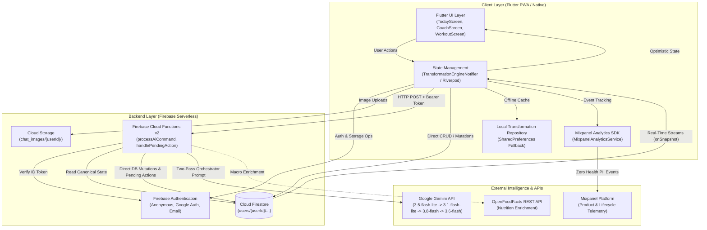
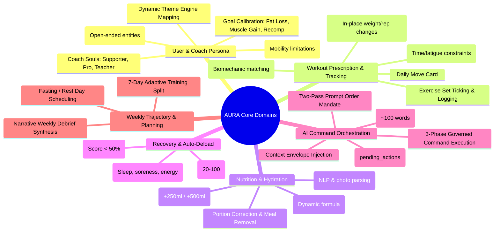
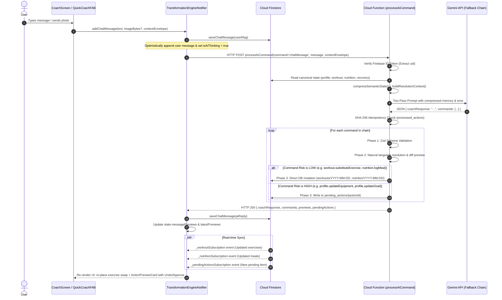
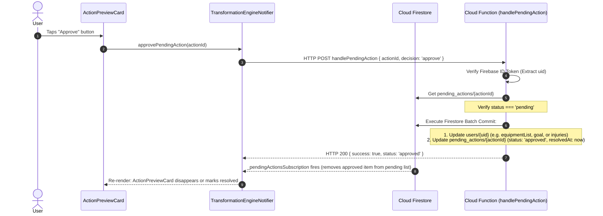

# AURA System Architecture & Engineering Reference

> **Document Type**: Architecture & Engineering Knowledge Cache  
> **Target Audience**: Core Engineers, Systems Architects  
> **Source Code Scope**: `flutter_app/` (Client) & `functions/src/` (Backend Cloud Functions)  
> **Last Updated**: 2026-09-08  
> **Verification**: 100% grounded in source code analysis  

---

## 1. System Overview

**AURA** is an AI-native, adaptive personal wellness companion built as a cross-platform Flutter client (PWA, iOS, Android) backed by serverless Firebase Cloud Functions, Cloud Firestore, and Google Gemini Generative AI models.

Unlike traditional static fitness trackers, AURA operates on a **Single-Turn State Transition Architecture**:
Every user interaction—whether chatting with the coach, tapping a workout set, uploading a meal photo, or checking in on morning recovery—is evaluated in the context of the user's canonical state and processed through a governed command pipeline that applies deterministic state deltas.



---

## 2. Components Involved

### 2.1 Major Applications, Services & Packages

| Package / Directory | Technology | Responsibility |
|:---|:---|:---|
| `flutter_app/lib/` | Dart 3 / Flutter 3.x | Client UI shell, screen views, theme engines, Riverpod state container, real-time Firestore listeners, Mixpanel tracking. |
| `flutter_app/lib/providers/` | Riverpod `StateNotifier` | `TransformationEngineNotifier` and domain mutation mixins (`WorkoutMutations`, `NutritionMutations`, `RecoveryMutations`). |
| `flutter_app/lib/services/` | Dart | Abstractions for AI communication (`ai_service.dart`), Firebase (`firebase_service.dart`), local caching (`transformation_repository.dart`), and Mixpanel (`analytics_service.dart`). |
| `flutter_app/lib/theme/` | Flutter ThemeData | Coach-Soul responsive theming (`supporter`, `pro`, `teacher`), typography (Syne + Plus Jakarta Sans), fluid layout tokens. |
| `functions/src/` | TypeScript / Node.js 20 | Firebase Functions v2 (`onRequest`), Zod schema validators, semantic context compression, Gemini API client with 4-model fallback chain, governed Command Registry. |
| `functions/src/commands/` | TypeScript | Modular Command definitions (`workoutCommands.ts`, `nutritionCommands.ts`, `recoveryCommands.ts`, `profileCommands.ts`), registry, and execution pipeline. |
| `functions/src/context/` | TypeScript | Deterministic target resolution (`contextBuilder.ts`) and ~100-word working memory compressor (`compressSemanticState`). |

---

## 3. Communication Protocols & Transport

1. **Client → Backend Cloud Functions**:
   - Transport: HTTPS POST with `Content-Type: application/json`.
   - Security: `Authorization: Bearer <Firebase_ID_Token>` validated via `admin.auth().verifyIdToken(idToken)`.
   - Timeout: 180 seconds server-side, 60 seconds client-side.
2. **Backend → Firestore**:
   - Transport: Server-side Node.js Google Cloud gRPC connection via `firebase-admin`.
3. **Firestore → Client (Real-time Sync)**:
   - Transport: Firestore WebSocket / long-polling listeners (`.snapshots()`).
   - Sockets maintained per active domain collection: `workouts`, `nutrition`, `recovery`, `chats`, `pending_actions`, `weekly_plans`.
4. **Backend → Gemini API**:
   - Transport: Direct HTTPS POST to `https://generativelanguage.googleapis.com/v1beta/models/{model}:generateContent?key={apiKey}`.
   - Credentials: Securely loaded from Google Cloud Secret Manager (`defineSecret('GEMINI_API_KEY')`).
5. **Client → Mixpanel**:
   - Transport: Client-side SDK (`mixpanel_flutter` ^2.4.0) sending batches over HTTPS.

---

## 4. Main Databases & Storage Architecture

### 4.1 Cloud Firestore Schema

All user data is strictly scoped under `users/{userId}`. The Firestore Security Rules enforce: `request.auth != null && request.auth.uid == userId`.

```
users/{userId}                                (Document: UserProfile & Canonical Settings)
  ├── workouts/{YYYY-MM-DD}                   (Document: DailyWorkout prescription & sets)
  ├── nutrition/{YYYY-MM-DD}                  (Document: DailyNutrition targets & logged meals)
  ├── recovery/{YYYY-MM-DD}                   (Document: RecoveryCheckIn & Readiness Score)
  ├── chats/{messageId}                       (Document: ChatMessage text, images, timestamps)
  ├── pending_actions/{actionId}              (Document: Pending structural mutation proposals)
  ├── processed_actions/{actionHash}          (Document: Idempotency deduplication lock)
  ├── weekly_plans/{weekId | 'current'}       (Document: 7-day adaptive schedule)
  └── master_context/current                  (Document: Deduced knowledge & rolling 7-day stats)
```

#### Detailed Document Schemas:

* **`users/{userId}`**:
  - `name`, `age`, `gender`, `heightCm`, `weightKg`, `targetWeightKg`
  - `goal`: `'fat_loss'` | `'muscle_gain'` | `'recomp'`
  - `daysPerWeek`: Prescribed weekly training frequency (`2-6`)
  - `targetPhysique`: Free-form aspiration string (e.g., `'Athletic V-Taper'`)
  - `equipmentList`: Array of semantic objects `[{ name, category, weightKg }]`
  - `activeInjuries`: Array of strings `['lower back tightness', 'left knee pain']`
  - `dislikedExercises`: Array of strings
  - `personalNotes`: Array of lifestyle constraints
  - `coachSoul`: `'supporter'` | `'pro'` | `'teacher'`
  - `dietaryPreference`: `'nonVeg'` | `'vegetarian'` | `'vegan'` | `'eggetarian'`
  - `createdAtDateStr`: String `'YYYY-MM-DD'` (used to prevent phantom unlogged days before signup)
  - `updatedAt`: Firestore server timestamp

* **`users/{userId}/workouts/{YYYY-MM-DD}`**:
  - `id`, `date`, `title`, `focusArea`, `estimatedDurationMin`
  - `status`: `'scheduled'` | `'completed'` | `'skipped'`
  - `adaptationNote`: String explanation if modified by AI or deload
  - `exercises`: Array of Exercise objects:
    - `id`, `name`, `targetMuscle`, `equipmentRequired`, `notes`
    - `sets`: Array of `[{ setNumber, targetReps, targetWeightKg, completed }]`

* **`users/{userId}/nutrition/{YYYY-MM-DD}`**:
  - `date`, `targetCalories`, `targetProteinG`, `targetCarbsG`, `targetFatG`, `targetWaterMl`, `waterMl`
  - `meals`: Array of `[{ name, calories, proteinG, carbsG, fatG }]`

* **`users/{userId}/recovery/{YYYY-MM-DD}`**:
  - `date`, `sleepHours`, `sleepQuality` (1-10), `muscleSoreness` (1-10), `energyLevel` (1-10), `stressLevel` (1-10)
  - `recoveryScore`: Composite integer (`20-100`)
  - `status`: `'Optimal Adaptation'` | `'Moderate Readiness'` | `'High Fatigue (Deload Advised)'`

* **`users/{userId}/pending_actions/{actionId}`**:
  - `id`, `actionType`, `arguments`, `description`, `status` (`'pending'` | `'approved'` | `'rejected'`), `createdAt`, `resolvedAt`

* **`users/{userId}/processed_actions/{actionHash}`**:
  - `processedAt`: Server timestamp, `commandCount`: number. Keyed by `SHA-256(uid + messageId + text + commands)` to enforce idempotency.

---

## 5. Major Business Domains



---

## 6. Detailed Trace of Critical Execution Paths

### 6.1 Flow 1: Conversational AI Command & Governed State Delta

**Trigger**: User sends a natural language message or photo in Coach Chat or Quick Coach FAB (e.g., *"My knee hurts on split squats, swap it and I ate 3 eggs"*).



#### Code Locations & Symbols:
- **Client Entry**: `CoachScreen._sendMessage` in `flutter_app/lib/screens/coach_screen.dart`
- **State Handler**: `TransformationEngineNotifier.addChatMessage` in `flutter_app/lib/providers/transformation_state.dart`
- **Service Invocation**: `GeminiAIProvider.processCoachMessage` in `flutter_app/lib/services/ai_service.dart`
- **Cloud Function Handler**: `processAiCommand` (`command: 'chatMessage'`) in `functions/src/index.ts`
- **Context Builder & Compression**: `compressSemanticState` & `buildResolutionContext` in `functions/src/context/contextBuilder.ts`
- **Command Engine**: `CommandRegistry.executeChain` in `functions/src/commands/registry.ts`

---

### 6.2 Flow 2: High-Risk Structural Action Approval

**Trigger**: User taps "Approve" on an `ActionPreviewCard` generated for a high-risk proposal (e.g., equipment update, goal recalibration).



#### Code Locations & Symbols:
- **Client Widget**: `ActionPreviewCard` in `flutter_app/lib/screens/widgets/action_preview_card.dart`
- **State Handler**: `TransformationEngineNotifier.approvePendingAction` in `flutter_app/lib/providers/transformation_state.dart`
- **Backend Endpoint**: `handlePendingAction` in `functions/src/index.ts`

---

### 6.3 Flow 3: Onboarding Calibration & Account Creation

**Trigger**: User finishes the 4-step onboarding wizard and taps "Calibrate Transformation Baseline".

1. **Client Entry**: `OnboardingScreen._runCalibrationAndComplete` in `flutter_app/lib/screens/onboarding_screen.dart`
2. **Auth Provisioning**: `FirebaseAuthService.signInWithGoogle()`, `signUpWithEmailAndPassword()`, or `signInAnonymously()` creates a Firebase session.
3. **Canonical Profile Write**: `FirebaseFirestoreService.saveUserProfile(uid, profile)` writes the baseline demographic doc to `users/{uid}`.
4. **Metabolic Plan Generation**: `aiService.generateAIMetabolicPlan(profile)` calls Cloud Function `command: 'generateMetabolicPlan'`, which calculates target calories and macros and persists `users/{uid}/nutrition/{todayStr}`.
5. **Initial Workout Generation**: `aiService.generateAIInitialWorkout(profile)` calls Cloud Function `command: 'generateAIInitialWorkout'`, which designs day 1 exercises matching available gear and persists `users/{uid}/workouts/{todayStr}`.
6. **Analytics Telemetry**: Mixpanel distinct ID is identified (`analytics.setUserId(uid)`), profile properties set (`$name`, `coach_soul`, `goal_type`), super properties registered, and `plan_calibrated` and `sign_up_completed` events are emitted.
7. **Launch**: `notifier.completeOnboarding(finalProfile)` switches root routing from `OnboardingScreen` to `MainShell`.

---

### 6.4 Flow 4: Morning Recovery Check-in & Auto-Deload

**Trigger**: User logs sleep duration or soreness level on `TodayScreen`.

1. **Client Entry**: `TodayScreen` sliders call `notifier.updateRecoveryCheckIn(...)`.
2. **Readiness Calculation**: In `RecoveryMutations.updateRecoveryCheckIn` (`flutter_app/lib/providers/mutations/recovery_mutations.dart`):
   $$\text{sleepScore} = \left(\text{clamp}\left(\frac{\text{sleepHours}}{8.0}, 0.0, 1.2\right)\right) \times 10 \times \left(\frac{\text{sleepQuality}}{10.0}\right)$$
   $$\text{score} = \text{clamp}\Big(\text{round}\big((\text{sleepScore} \times 3.5) + (\text{energyLevel} \times 3.5) + ((10 - \text{muscleSoreness}) \times 2.0) + ((10 - \text{stressLevel}) \times 1.0)\big), 20, 100\Big)$$
3. **Persistence**: Saves `RecoveryCheckIn` to Firestore `users/{uid}/recovery/{todayStr}`.
4. **Fatigue Gate**: If $\text{score} < 50$, `handleFatigueDeload(score)` is triggered:
   - Calls `_aiService.generateAIAdaptedWorkout(state, 'High fatigue detected (Score: $score%). Deload the workout for active recovery.')`.
   - Cloud Function adapts today's workout into an active recovery / mobility routine and updates `users/{uid}/workouts/{todayStr}`.
   - `_workoutSubscription` detects the change and updates `state.workout` live.

---

## 7. Important Business Rules

### 7.1 Confirmed from Source Code

| Business Rule | Implementation Source | Detail |
|:---|:---|:---|
| **Deterministic Natural Language Resolution** | `contextBuilder.ts` (lines 27-118) | Pronouns like *"this"*, *"it"*, *"current"* resolve using the `ContextEnvelope` (`focusedExerciseName` or `focusedExerciseId`). Ordinals (*"first"*, *"second"*, *"last"*) resolve by index. |
| **Two-Pass AI Generation Mandate** | `index.ts` (lines 172-174) | The system prompt forces Gemini to emit `"coachResponse"` *first* in JSON before emitting `"commands"`, preventing hallucinated mechanical actions without conversational empathy. |
| **Idempotent Action Execution** | `index.ts` (lines 222-240) | Hashes input `SHA-256(uid + messageId + prompt + commands)` into `processed_actions/{hash}`. Duplicate requests do not execute actions twice. |
| **Structural Change Confirmation Gate** | `profileCommands.ts` (lines 38-120) | High-risk profile changes (`updateEquipment`, `updateGoal`, `updateSchedule`, `updateInjuries`) do *not* mutate user profile immediately; they write to `pending_actions` and require explicit user approval. |
| **Account Creation Guard for Past Days** | `transformation_state.dart` (lines 249-251) | Unlogged past days banner strictly filters out days before `profile.createdAtDateStr` to prevent showing guilt/skipped prompts to new users. |
| **Zero Health PII Analytics Boundary** | `AGENTS.md` (lines 12-14) | Raw body weights, physique photo URLs, and medical injury descriptions are never sent to Mixpanel properties. Only enum categories and numeric set counts are tracked. |

### 7.2 Inferred / Architectural Deductions

- **OpenFoodFacts Integration**: The server defines `lookupFoodMacros` with a 3500ms timeout against OpenFoodFacts, and passes it into `ExecutionContext`. Currently, `nutritionCommands.ts` defaults to heuristic macro fallbacks for common foods (e.g. eggs = 75 kcal) before calling the external API.
- **Enterprise to Standard Migration Endpoint**: The Cloud Function `migrateEnterpriseToStandard` is an administrative utility secured by `MIGRATION_SECRET` (`aura-migrate-enterprise-standard-2026`) used for bulk data migration.

---

## 8. Error Handling & Resiliency

1. **Gemini Multi-Model Fallback Chain**:
   `functions/src/gemini.ts` (lines 27-100)  
   Sequentially attempts:
   `gemini-3.5-flash-lite` $\rightarrow$ `gemini-3.1-flash-lite` $\rightarrow$ `gemini-3.8-flash` $\rightarrow$ `gemini-3.6-flash`.
   High-value structural plans (weekly plan, metabolic baseline) prioritize `gemini-3.8-flash`.
   Each model is attempted up to 2 times with exponential backoff on HTTP 429/503. If a model returns 404, it immediately falls forward to the next candidate.
2. **Prompt Injection Sanitizer**:
   `functions/src/gemini.ts` (lines 10-15)  
   Strips triple backticks and redacts phrases such as `SYSTEM INSTRUCTION`, `IGNORE ALL PREVIOUS INSTRUCTIONS`, `YOU ARE NOW`, and `ADMIN MODE`.
3. **Anonymous Auth Fallback**:
   `flutter_app/lib/services/ai_service.dart` (lines 48-63)  
   If an unauthenticated user triggers an AI command, the client silently authenticates anonymously with Firebase before fetching the ID token for the Cloud Function call.
4. **Offline Local Repository Fallback**:
   `LocalTransformationRepository` (`flutter_app/lib/services/transformation_repository.dart`) caches profile, workout, nutrition, and recovery into `SharedPreferences` as a resilient fallback if Firestore is temporarily unreachable.

---

## 9. Key File Index & Symbol Reference

### Client Layer (`flutter_app/lib/`)
- `main.dart`: Entrypoint, `AuraPwaApp`, `MainShell` tab switching, `didChangeAppLifecycleState` day refresh.
- `providers/transformation_state.dart`: Core state container (`TransformationEngineNotifier`), Firestore stream subscriptions, Master Context builder.
- `providers/mutations/workout_mutations.dart`: `updateExerciseSet`, `updateSetTarget` (micro-deviations), `substituteExercise`.
- `providers/mutations/nutrition_mutations.dart`: `addWater`, `addMeal`, `logNutritionForDate`, `updateMealPortionForDate`.
- `providers/mutations/recovery_mutations.dart`: `updateRecoveryCheckIn`, readiness score formula, `handleFatigueDeload`.
- `services/ai_service.dart`: `GeminiAIProvider`, Cloud Function proxy invoker, Auth header builder.
- `services/firebase_service.dart`: `FirebaseAuthService`, `FirebaseFirestoreService` (CRUD and stream factories).
- `screens/today_screen.dart`: Prescription board, 7-day week strip, unlogged past days backfill, Move card.
- `screens/coach_screen.dart`: Coach chat, camera/photo picker, action chips, `ActionPreviewCard` host.
- `screens/workout_screen.dart`: Live workout tracking, set completion, in-session "Adapt AI" bottom sheet.

### Server Layer (`functions/src/`)
- `index.ts`: Cloud Function exports (`processAiCommand`, `handlePendingAction`, `migrateEnterpriseToStandard`).
- `gemini.ts`: `executeGeminiCall` (4-model fallback chain), `sanitizeUserPrompt`.
- `context/contextBuilder.ts`: `buildResolutionContext`, `compressSemanticState`, deterministic target matching.
- `commands/registry.ts`: `CommandRegistry`, 3-phase execution (`validate` $\rightarrow$ `resolve`/`preview` $\rightarrow$ `execute`).
- `commands/workoutCommands.ts`: `workout.substituteExercise`, `workout.adjustVolume`, `workout.adapt`, `workout.updateStatus`.
- `commands/nutritionCommands.ts`: `nutrition.logMeal`, `nutrition.updatePortion`, `nutrition.removeMeal`.
- `commands/profileCommands.ts`: `profile.updateEquipment`, `profile.updateGoal`, `profile.updateInjuries`, `profile.updateSchedule`.

---

## 10. Open Questions & Future Technical Considerations

1. **OpenFoodFacts Real-Time Integration**: `lookupFoodMacros` is defined in `functions/src/index.ts` and wired into `ExecutionContext`, but `nutritionCommands.ts` does not yet call it dynamically during meal resolution. Calling it for unknown meal names would significantly improve macro accuracy.
2. **Offline Data Mutation Queue**: While `LocalTransformationRepository` caches snapshots locally, mutations performed while offline (e.g. ticking a set without internet) rely on Firestore's native offline persistence. A structured client mutation queue could provide explicit offline sync status.
3. **Master Context Rolling Aggregation Frequency**: Currently, `buildAndSaveMasterContext()` is invoked on specific state changes. As the user's history extends beyond 30 days, moving rolling summary computation to a scheduled Cloud Function (cron) would reduce client payload overhead.
