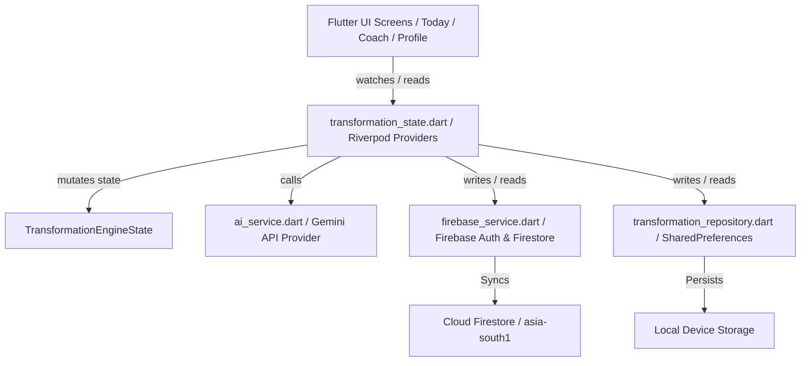
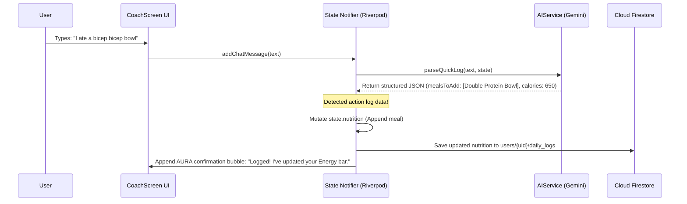

# AURA Technical Architecture & State Review

This document provides a comprehensive technical review of AURA's system architecture, current implementation state, data flow pipelines, and technical roadmap.

---

## 🏗️ 1. System Architecture

AURA is architected as a decoupled, state-driven, local-first Flutter application utilizing **Riverpod** for state management and an **adapter pattern** for database and AI services.

### Key Architectural Layers:
*   **State Management:** Riverpod (`StateNotifierProvider`). The `transformationEngineProvider` holds the user's active baseline `UserProfile`, today's `DailyWorkout`, `DailyNutrition`, `RecoveryCheckIn`, progress graphs data, and chat log logs in a single unified state.
*   **Adaptation Engine:** Handles AI-driven plan updates dynamically. If a metric shifts (e.g. sleep quality drops or weight stalls), the notifier queries the `AIService` and applies mutations asynchronously.
*   **Database Adapters:** Decoupled interfaces (`ITransformationRepository` and `FirebaseFirestoreService`). They save states locally (offline-first) and sync data to Firebase collections.

---

## 📊 2. Implementation State Matrix

The table below outlines our progress across all architectural components:

| Component | Target Spec | Current Implementation State | Status |
| :--- | :--- | :--- | :---: |
| **Theme Engine** | Dynamic personality-driven themes & fonts. | Fully integrated. Themes switch between Warm Void (Supporter), Deep Void (Pro), and Slate Void (Teacher) using Clash & Plus Jakarta Sans typography. | **Complete** |
| **AURA Orb** | Procedural radial gradient animations. | Built custom stateful canvas-drawn widget supporting `pulsing`, `rippling`, and `swirling` states. | **Complete** |
| **Onboarding** | Frictionless 4-step wizard. | Implemented obstacle selection, sliders, soul selection, and Firebase Auth calibration trigger. | **Complete** |
| **Database** | Offline-first local + cloud sync. | Implemented actual `firebase_core`, `firebase_auth`, and `cloud_firestore` SDK bindings. | **Complete** |
| **Today Screen** | Prescription-centric board with macro bottom sheets. | Implemented gradient Moves card, interactive Fuel bars with bottom sheet metric expanders, and recovery log dialogs. | **Complete** |
| **Coach Chat** | Large Orb + suggestion chips + logging. | Implemented dynamic bubble coloring, action suggestions, inline interactive portion buttons, and OCR mock scanning. | **Complete** |

---

## 🔄 3. Closed-Loop Ingestion & Data Flow

The conversational chat flow uses a two-pass ingestion system to bridge text inputs and structured database mutations:

### Multi-modal OCR Pipeline:
When a user attaches an Apple Watch screenshot:
1. UI triggers `simulateWatchScreenshotScan()` which appends a placeholder message with a **sliding laser scan bar animation**.
2. State processes mock OCR parsing delay.
3. State marks the daily activity as `completed` and appends the burnt active calories directly to the Today dashboard.

---

## 🚀 4. Next Technical Roadmap Steps

To transition the product from a solid alpha prototype to a production-grade release, we recommend prioritizing these tasks:

> [!IMPORTANT]
> **Authentication Enhancement:** Integrate standard Apple Sign-in credentials alongside Google Auth to support native iOS device runs.

> [!TIP]
> **Real-time Streams:** Currently, the screen reads from `ref.watch(transformationEngineProvider)`. Transition this to an active Firestore document snapshot stream (`snapshots()`) so changes made on the web console or external devices sync to the UI in real time.

> [!WARNING]
> **PWA Service Workers:** Set up offline-cache rules for Google Fonts and local asset loading in `web/index.html` to guarantee the app loads instantly without network connectivity.
